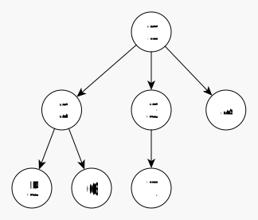
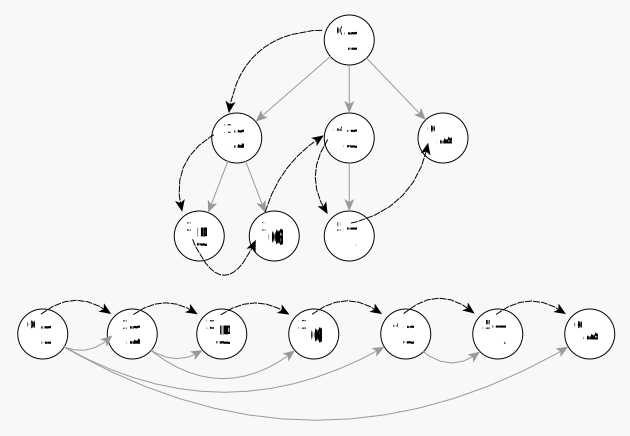
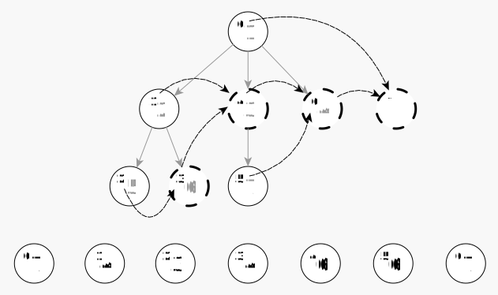

# Generating all ideals of an arborescence.

This is a description of an algorithm for generating all ideals of an arborescence, where $\mathcal{I}$ is the number of ideals in the tree, with a constant amortized time of $O(1)$ per transition from $ideal_n$ to $ideal_{n+1}$ and an overall complexity of $O(\mathcal{I})$. It is believed this algorithm presents a novel approach not written about previously. The algorithm is short and simple to understand consisting of a pop, jump and push per ideal. I find it hard to believe it hasn't been written about _somewhere_ but I wasn't able to find it described anywhere. Please contact me if you have seen it.

This problem is similar to generating forest ideals and can also be referred as:
- Generate all rooted partial trees of a rooted tree.
- Generate all r rooted subtrees of the tree rooted at $r$.
- Generate all ordered combinations of descendants in a rooted tree.


This repository contains:
- Python implementations of both the Pop Jump Push and Koda-Ruskey algorithms in the `python` directory.
- Rust implementations of both the Pop Jump Push and Koda-Ruskey algorithms in the `src` directory.
- Rust implementation of a parallel approach to the Pop Jump Push algorithm in the `src` directory.


Here's a brief summary showing python, pypy and rust generating all ideals of a 31 node fully balanced tree 100 times.
```text
Getting test set: set_31B
Generating 458,328 ideals from 31 nodes 100 times (45,832,900).

*** Python ***
pop_jump_push   96.83866478881582 ns avg per ideal
koda_ruskey    152.321651135006 ns avg per ideal

*** pypy ***
pop_jump_push   13.474159975150592 ns avg per ideal
koda_ruskey     17.237536134107437 ns avg per ideal

*** Rust ***
pop_jump_push    1.6211760547554268 ns avg per ideal
koda_ruskey      5.092732513107397 ns avg per ideal
```

It should also be noted that a parallel Pop Jump Push implementation which processes in chunks scales nicely with physical cores (since it is cpu-bound). Tree structure plays a big part in how many workers can be used. A 63 node fully balanced tree will not chunk well for 16 workers but 13 works fine.

```text
Getting test set: set_63B
Generating 210066388900 ideals from 63 nodes 1 times (210066388900).

*** Rust ***
par_pop_jump_push    Avg Duration per tree   64.0275749 (13 workers)
par_pop_jump_push    Avg Duration per tree   68.0275749 (8 workers)
pop_jump_push        Avg Duration per tree  340.8131211
koda_ruskey          Avg Duration per tree 1054.7239127
```

----

$Algorithm\ 1$ (Pop, jump and push ideals generation). Given an arborescence whos nodes are the sequence $(0, \ldots, n-1)$ when arranged in preorder, this algorithm visits all tuples $(s_1, \ldots, s_n)$ where $s_p \le s_c$ whenever $p$ is the parent of $c$. Rightmost subtrees are pushed or popped between one visit and the next. A single array of jump pointers $[j_1, j_2,\ldots,j_{n}]$ indicates the first node of the next right subtree or $n$ if one doesn't exist.


**Steps**: 

```text
while s:
    visit s
    i = j[s.pop()]
    s.push([i..n))
```

## How it works...

a) Begin with a tree:



```
Labels:
    root = 1
    parents = [X,1,1,1,2,2,3]
    children = [1,2,3,4,5,6,7]
```

b) Sort the tree's node labels/objects/pointers to pre-order.



```
Pre-Order:
    root = 1
    parents = [X,1,2,2,1,3,1]
    children = [1,2,5,6,3,7,4]
    indices = [0,1,2,3,4,5,6]
```

c) Get the pre-order index of the first node of the next right subtree for each node. Use 'n' for the missing rightmost at the end.



```text
Next Subtree Root:
    root = 1
    parents = [X,1,2,2,1,3,1]
    children = [1,2,5,6,3,7,4]
    indices = [0,1,2,3,4,5,6]
    jump_indices = [7,4,3,4,6,6,7]
```

d) Consume the end of the indices and replenish from the root of the next subtree to the last descendant of the tree.

```text
f(j=jump_indices)
    n = |j|
    s = [0..n)
    While s:
        visit s
        i = j[s.pop()]
        s.push([i..n))
```

```text
    visit           _=pop()    i=j[_]    [i..n)       s_result
    0,1,2,3,4,5,6   6          7         {}           0,1,2,3,4,5
    0,1,2,3,4,5     5          6         {6}          0,1,2,3,4,6
    0,1,2,3,4,6     6          7         {}           0,1,2,3,4
    0,1,2,3,4       4          6         {6}          0,1,2,3,6
    0,1,2,3,6       6          7         {}           0,1,2,3
    0,1,2,3         3          4         {4,5,6}      0,1,2,4,5,6
    0,1,2,4,5,6     6          7         {}           0,1,2,4,5
    0,1,2,4,5       5          6         {6}          0,1,2,4,6
    0,1,2,4,6       6          7         {}           0,1,2,4
    0,1,2,4         4          6         {6}          0,1,2,6
    0,1,2,6         6          7         {}           0,1,2
    0,1,2           2          3         {3,4,5,6}    0,1,3,4,5,6
    0,1,3,4,5,6     6          7         {}           0,1,3,4,5
    0,1,3,4,5       5          6         {6}          0,1,3,4,6
    0,1,3,4,6       6          7         {}           0,1,3,4
    0,1,3,4         4          6         {6}          0,1,3,6
    0,1,3,6         6          7         {}           0,1,3
    0,1,3           3          4         {4,5,6}      0,1,4,5,6
    0,1,4,5,6       6          7         {}           0,1,4,5
    0,1,4,5         5          6         {6}          0,1,4,6
    0,1,4,6         6          7         {}           0,1,4
    0,1,4           4          6         {6}          0,1,6
    0,1,6           6          7         {}           0,1
    0,1             1          4         {4,5,6}      0,4,5,6
    0,4,5,6         6          7         {}           0,4,5
    0,4,5           5          6         {6}          0,4,6
    0,4,6           6          7         {}           0,4
    0,4             4          6         {6}          0,6
    0,6             6          7         {}           0
    0               0          7         {}           {}
```

The visited indices can be used to lookup the original node labels/objects/pointers from step b without further processing.

Another option is to manipulate values alongside the indices sequence.

Let each node be given a weight in $W = [w_0,…,w_{n−1}]$ and have $w = \sum W$. Then

```text
while s:
    visit s, w
    i = s.pop()
    w = w - W[i]
    i = j[i]
    s.push([i..n))
    w = w + sum(W[i..n))
```

would generate a weight for each ideal without requiring further iteration over the visited indices sequence.

e) terminate


## Analysis

### Overall Growth

The primary constraint in the time complexity of this problem is directly related to the combinatorial explosion in the number of ideals $(\mathcal{I})$ as the number of nodes $(n)$ increases. The value of $\mathcal{I}$ is directly related to the structure of the tree.

_Regardless of the structure the tree the total number of elements pushed, including populating the initial array, is equal to the number of elements popped which is equal to $\mathcal{I}$.

$\mathcal{I}$ for a rooted tree structure
- when wide and shallow is $2^{n-1}$.
- when narrow and deep is $n$.
- in the balanced tree case is given in [A004019][1] and is
$$\mathcal{I}(n+1) = 1 + 2\mathcal{I}(n) + \mathcal{I}(n)^2 = (1+\mathcal{I}(n))^2$$

#### Worst Case (wide and shallow)

In the worst case this algorithm is equivalent to counting in binary in descending order while tracking the last '1' bit. The last '1' bit is flipped off and the remaining bits are flipped on which is equivalent to popping the last element of our indices sequence array and pushing the remaining elements with a $\ge$ index.

This means the number of elements pushed in the worst case tree is equal to the number of bits _enabled_ while counting in binary which is $2^{n-1} = \mathcal{I}$ and the count of push instances is $2^{n-2}$. As such the average number of elements pushed per push instance is $2$ and the overall is amortized to $1$.

This results in a worst case constant amortized cost of $O(1)$ per ideal and an overall complexity of $O(\mathcal{I})$.


#### Balanced Tree Case

In the balanced tree case, the number of ideals is given by the [OEIS A004019][1] sequence and grows exponentially with $n$. The number of push instances is the product of the number of binary trees of height less than or equal to $n-1$ as given by [OEIS A003095][2].

$\quad\text{Where n is the number of levels in the balanced tree we have}$


$$
\lim_{n \to 5\texttt{+}} \text{ average pushed per instance} = 
\frac{\text{count pushed elements}}
{\text{count of push instances}} = \frac{A004019(n)}{\prod\limits_{i=1}^{n}{A003095(i)}}
 = 2.60385\ldots
$$


$\quad\text{The limit, to 512 bits of precision, is reached by } n=10.$

This results in a balanced tree case constant amortized cost of $O(1)$ per ideal and an overall complexity of $O(\mathcal{I})$.

#### Best Case (narrow and deep)

In the best case, the number of ideals is equal to the number of nodes $(n)$ and there is only one push instance per node which takes place while initializing the array. No pushes take place during processing.

This results in a best case constant time cost of $O(1)$ per ideal and an overall complexity of $O(\mathcal{I})$.


### Conclusion

The time complexity of the pop jump push algorithm for generating the ideals of an arborescence is directly related to the structure of the tree. In the worst case, the balanced tree case and the best case the algorithm has a constant amortized time complexity of $O(1)$ per ideal and an overall complexity of $O(\mathcal{I})$.


[1]:https://oeis.org/A004019 "OEIS - Number of rooted subtrees in binary tree of depth n."

[2]:https://oeis.org/A003095 "OEIS - Number of binary trees of height less than or equal to n."
